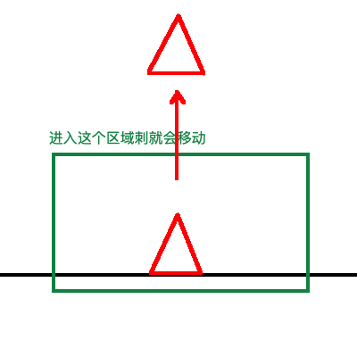
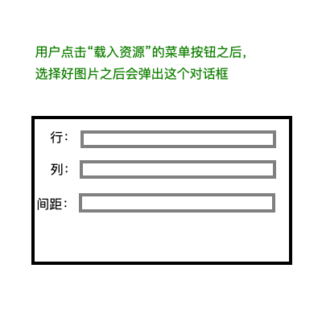
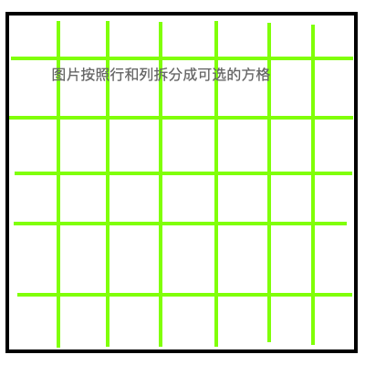
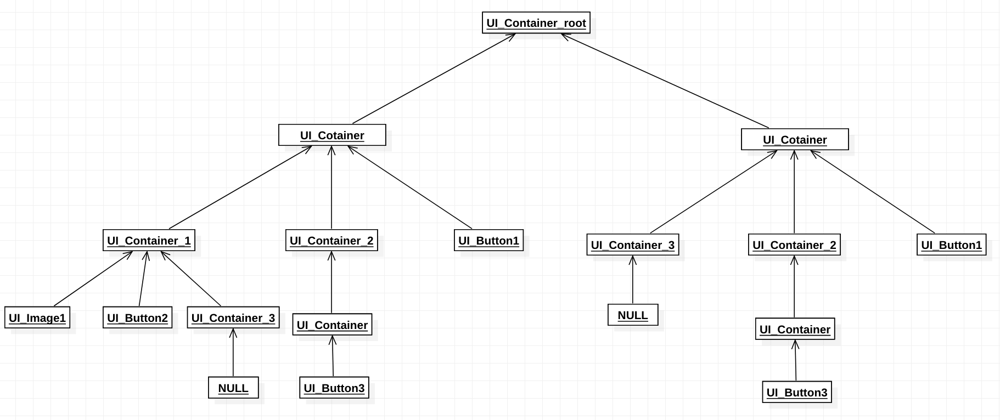

地图编辑器MapEditor设计

# 地图编辑器目标
地图编辑器的目标是能够在地图编辑器上编辑方块，刺，苹果等必须元素

# 设计
## 对物品的设计
地图上的物品分为两类：
* 静态的贴图类：这一类不能够进行碰撞
* 动态的物体类：这一类可以进行碰撞

每一个物品都可以做到：
* 旋转
* 平移（按照折线或者单一的速度向量）

其中动态物体类可以**被触发**。所谓被触发就是指当kid离某个物体一定距离的时候，这个物体可以作出一系列动作（比如刺从砖块里面弹出来）。
被触发需要一个范围，这个范围可以是椭圆或者矩形：

每一个物品移动的时候还可以有延时，对每一个动作设定一个延时时间，可以让这个动作在完成之后等待数秒钟。

## 对编辑器的设计
编辑器首先需要一系列的菜单：
* 保存：将文件保存成Json文件
* 载入地图：通过将Json文件和资源文件载入，重现地图
* 另存为：将文件另外保存
* 载入资源：将地图资源载入编辑器
* 动作：用于指定物品的动作

需要一个工具栏用于放置物体。编辑器自带一些可用的物体：
* 苹果
* 云
* 存档点
* 刺

需要一个地图切分窗体，这个窗体是在用户载入地图资源的时候，将切分好的地图放在这个窗口里面：

然后就会在窗口里面出现这个资源的切分状态:

然后用户点击这里面的方格就可以选中图片的一部分了。

当用户选中了方格之后就可以在地图上进行绘制了。

## UI设计
具体的UI设计请见文件“地图编辑器_原型设计.mp”

# 详细设计
## 界面UI
界面的UI使用SDL绘制，其事件处理采用回调函数的方式处理。

由于使用的是C语言，所以我们的通过“包含”的方式来实现继承。也就是说子结构体需要包含父结构体的信息。
当需要使用父结构体的时候我们可以通过强制转换的方式来实现。

### 控件结构体的设计
#### 基本元素的结构体
首先是用于表示基本信息的结构体，包括位置，大小，背景颜色。

所有的控件都有一个默认的事件函数，用户的事件函数是在默认的事件函数里面调用的。

其次是各个组件自己特定的信息设计。这一部分需要包括在特定的结构体中。

控件被分为两类：
* 容器
* 非容器

容器可以包含容器和非容器，从而成为如下的容器树：

其中每一个窗口都需要至少一个`UI_Container_root`。容器被视为Panel，是可以显示的。

树中的所有叶子节点都是非容器类控件，所有的内部节点都是容器类控件。最后需要对树进行前序遍历，然后对每一个叶子节点进行事件分发。

这就需要每个容器类都需要一个列表来存储自己的孩子节点。每一个非容器类都需要一个父节点来存储自己的父亲。

**事件传递机制的设计**
由于存在渲染树，在每次渲染的时候，我们需要将事件在渲染之前发送给叶子节点，然后叶子结点会根据自己的bubble属性来判断是否要将这个事件传给自己的父节点，让父节点也处理这个事件。这种情况是一个递归，直到根节点。

## 绘制树
使用树的方式来绘制结构体，在树中使用前序遍历的方式来实现绘制。

## 布局器
布局器可以承载控件，并且自动改变控件的大小和位置（但是不能够改变控件的其他属性）。